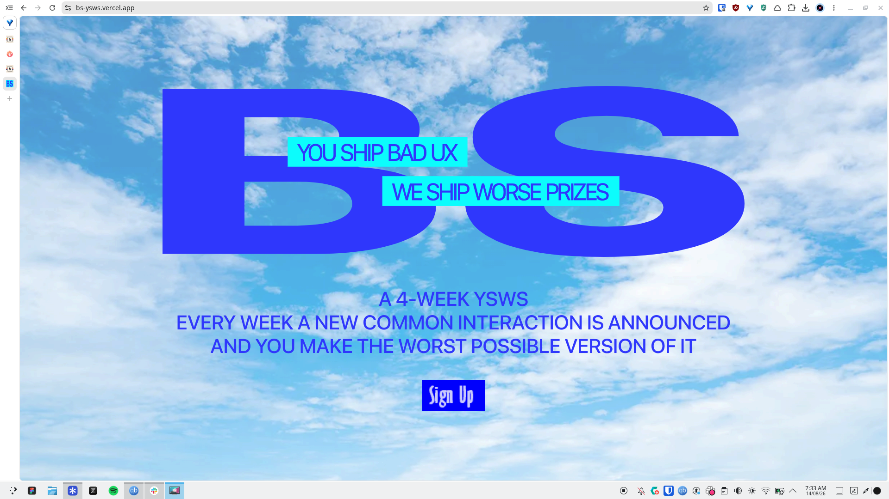

# bs

[demo](https://bs-ysws.vercel.app/)

a 4-week ysws where each week a ux interaction is announced, of which, you have to make the worst possible version. it's fun trust! coming really soon!!!!

## tell me more

this specific version of the ysws website was made for the ysws internship. i wasn't selected for the offline interns but i did get selected for the online ysws internship! this was made on the night of the application's deadline with vanilla html, css and js, so do NOT blame me if it's laggy or doesn't work on small screens.

## how to run the thing

just clone the repo and run a live server.

## ai usage

i don't really remember how much ai was used tbh cuz it's been like a few months but i think i used a bit of ai for the gifs circled around the text thingy.
